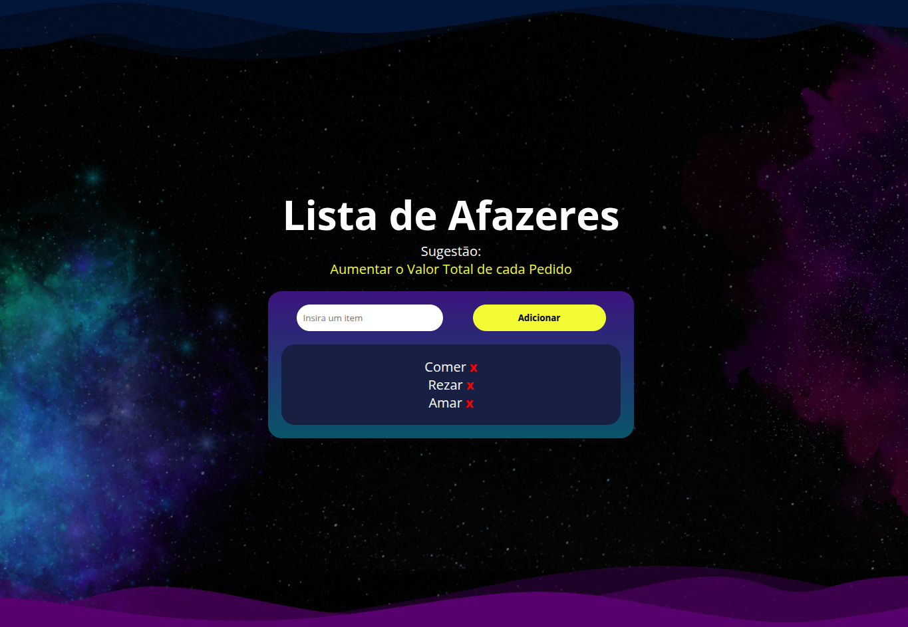
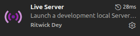

# Lista de Afazeres(To-do List JS)

Esse teste prático foi feito Utilizando HTML, CSS e Javascript. Ele contém: Input de texto, botão de submit, uma lista e sugestões de input.

Abaixo um print do site:

<div align="center"></div>


# Como rodar localmente

Clone o projeto colocando no terminal a seguinte linha:

```bash
git clone https://github.com/Oldiney1/ToDoListJS.git
```

Em seguida é só abrir o arquivo com a IDE de sua escolha(recomendo o VSCode) com os comandos abaixo(sistema linux). 

Pra entrar na pasta:
```bash
cd ToDoListJS
```

Pra abrir com vscode
```bash
code .
```
Com o VsCode aberto recomendo instalar a extensão "Live Server". Com ela instalada no VsCode vai aparecer um icone "Go Live" no canto inferior direito, clicando nele um aba no navegador vai ser aberta com a página carregada.

<div align="center"></div>